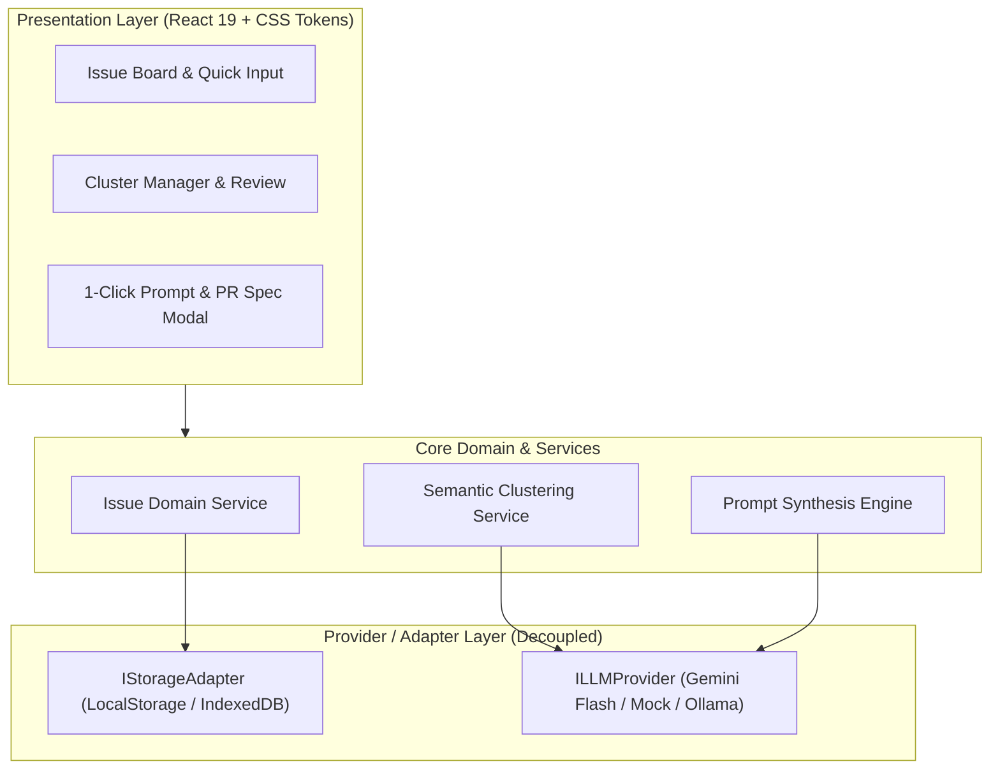

# Product Spine: Mini Issue Tracker (Smart Cluster & Prompt Orchestrator)

> **AI Product:** Yes (Uses LLMs for issue clustering, semantic analysis, and automated coding prompt / PR spec generation).

---

## 1. Vision

### One-Sentence Vision
An intelligent, lightweight issue tracker for solo developers and small teams that automatically clusters related bugs/tasks and synthesizes them into actionable, high-context AI prompts and Pull Request specifications.

### Target User & Problem
- **Target User:** Solo developers and small, agile engineering teams managing fast-moving codebases.
- **The Problem:** Incoming issue streams (bug reports, user feedback, feature notes) are fragmented, repetitive, and time-consuming to triage manually. Developers waste hours jumping between isolated tickets and rewriting context into LLM coding assistants.
- **Why Now (2026):** With agentic coding tools (like Gemini, Cursor, Copilot Workspace) handling execution, the developer's primary job has shifted from manual typing to **issue curation, clustering, and prompt orchestration**.

### Value Proposition (How It's Better & Different)
Unlike traditional static issue trackers (like basic GitHub Issues or Jira) which treat tickets as isolated silos:
1. **Automated Semantic Clustering:** Automatically detects related or duplicate issues sharing common root causes or components.
2. **One-Click AI Prompt & PR Spec Generation:** Combines clustered issues into an optimized, execution-ready developer prompt with explicit requirements, acceptance criteria, and reproduction steps.
3. **Frictionless & Lightweight:** Minimal setup, fast keyboard-driven UX, zero enterprise clutter.

### 2026 Market & Competitor Read
- **GitHub Issues:** Standard for repos, but triage is manual; native grouping requires paid GitHub Projects hierarchies without intelligent multi-issue prompt synthesis.
- **Linear:** Beautiful UX and fast, but focused on manual project management rather than turning issue clusters directly into AI agent work packets.
- **Sweep / Copilot Workspace:** Focuses on single-issue resolution per ticket, often missing the bigger picture when 3–4 minor bugs all stem from the same root file or workflow.
- **Sharpening Insight:** Triage and prompt synthesis are the new bottleneck. By turning groups of small issues into a single coherent batch prompt for AI coding agents, developers solve multiple problems in one testable PR rather than thrashing across 5 separate cycles.

### Job-To-Be-Done (JTBD)
> **When** multiple fragmented bug reports or feature ideas pile up in my project,  
> **I want to** automatically group related items and generate an accurate, execution-ready AI prompt or PR spec,  
> **So I can** resolve entire clusters of related issues in a single focused coding session without tedious manual triage.

### Core Product Parameters
- **North-Star Metric:** *Cluster-to-PR Velocity* (% of grouped issues successfully converted into actionable prompts/PRs within 5 minutes of review).
- **Riskiest Assumption:** Semantic clustering can accurately correlate poorly described user bug reports to the right underlying codebase components without excessive false positives.
- **Business Model:** Free & Open Source local-first developer tool (bring-your-own LLM API key / local models).

---

## 2. Scope

### The ONE Core Feature
**Automated Semantic Issue Clustering & Batch Prompt/PR Synthesis:**  
Automatically groups related incoming issues by component/root-cause and synthesizes them into an actionable, consolidated AI coding prompt & PR specification with one click.

### In-Scope (MVP — Core Usability)
1. **Issue Creation & Management:** Quick capture of bug reports and feature ideas (title, description, tags, status: `Open`, `Clustered`, `Resolved`).
2. **Automated Semantic Clustering Engine:** LLM-powered grouping of issues sharing common context, components, or root causes, with an explanation of *why* they are related.
3. **Prompt & PR Spec Generator:** 1-click synthesis of clustered issues into a structured, copy-ready prompt containing:
   - Problem summary & context
   - Affected files/components
   - Consolidated requirements & reproduction steps
   - Specific acceptance criteria for verification
4. **Fast, Dev-Centric UI:** Clean, responsive, dark-mode first interface with quick filtering and one-click copy.

### Deferred (+ Triggers)
- **Direct GitHub 2-Way Sync / Auto-PR Creation via GitHub API:**  
  *Trigger:* Once the manual copy-paste prompt generation workflow is proven useful in real developer cycles.
- **Multi-user Real-time Collaboration & Auth:**  
  *Trigger:* Multi-seat team adoption requests.
- **Custom Multi-LLM Provider Switcher (Ollama / Anthropic / OpenAI):**  
  *Trigger:* After establishing and stabilizing the default primary LLM provider.

### Non-Goals (Deliberately Never)
- **Enterprise Project Management Bloat:** No complex Gantt charts, sprint poker estimation, time tracking, or invoice management.
- **Native Mobile Apps:** Strictly focused on a lightning-fast desktop/browser developer experience.

---

## 3. Plan (Roadmap & Milestones)

### Milestones (Core-First Sequence)

| Milestone | Focus | Scope / Deliverables | Testable Exit Criterion |
| :--- | :--- | :--- | :--- |
| **M1: Core Vertical Slice** | Fast Capture & Prompt Synthesis | Issue CRUD (title, desc, tags), multi-issue selection, structured AI Prompt / PR Spec generation, and 1-click clipboard export. | A developer can input 3 bug reports, select them, and generate a fully formatted, copy-ready AI prompt in < 10 seconds. |
| **M2: Semantic Clustering Engine** | Auto-Triage & Grouping | LLM semantic clustering engine that detects related/duplicate issues, groups them by component/root cause, and displays clustering reasoning. | Given 6 unorganized issues, clicking "Auto-Cluster" correctly groups related tickets into cohesive clusters with similarity explanations. |
| **M3: Workflow Polish & Multi-Format Export** | Lifecycle & Export Profiles | Status transitions (`Open` → `Clustered` → `Resolved`), export presets (Coding Agent Prompt, GitHub PR Body, Issue Batch Summary), and keyboard shortcuts. | User can filter by cluster, batch-update statuses to `Resolved`, and export directly to markdown PR specs with single keybindings. |

---

### Concern-Area Coverage Matrix

| Area | Cadence | Notes / Implementation Strategy |
| :--- | :--- | :--- |
| **Security** | **Now** | Local-first storage, client-side API key encryption/safe local env, zero arbitrary code execution, sanitized markdown rendering. |
| **AI-Specific** | **Now** | Structured JSON schema outputs for clustering, prompt-injection defense on issue titles/descriptions, deterministic fallback grouping. |
| **Observability** | **Next** | LLM token usage tracking & latency logging (*Trigger: user connects external API key*). |
| **Developer Experience (DX)** | **Now** | Instant keyboard shortcuts (`Ctrl+Enter` save, `Esc` dismiss, `C` cluster), responsive dark mode, zero UI lag. |
| **Testing** | **Now** | Unit tests for issue state transitions, schema validation for LLM clustering responses, and prompt synthesis snapshot tests. |
| **Infra / Hosting** | **Now** | Zero-config local development setup (`Vite` / fast local runtime), no paid cloud infra required for core MVP. |
| **Documentation** | **Now** | `PRODUCT.md` spine, `README.md` with 1-minute quickstart guide, and preloaded sample issues for instant testing. |
| **Product** | **Now** | Measure cluster-to-prompt generation time and copy velocity against North-Star metric. |

---

## 4. Architecture (High-Level Design & ADRs)

### System Topology & Core Stack (2026 OSS-First)
- **Frontend Core:** **React 19 + TypeScript + Vite** (Lightning-fast HMR, native type safety, zero bundler bloat).
- **Styling & UI Tokens:** **Modern CSS Tokens (Custom Properties) + Lucide Icons** (Tailored dark theme, zero CSS-in-JS runtime overhead).
- **Datastore & State:** **Local-First Storage Engine (`IStorageAdapter`)** with versioned schema migrations in browser LocalStorage/IndexedDB.
- **AI & Synthesis Engine:** **`ILLMProvider` Adapter** with Gemini Flash / standard LLM endpoint support and strict JSON Schema output validation.

---

### Architecture Decision Records (ADRs)

#### ADR-1: Local-First Client Architecture via `IStorageAdapter`
- **Decision:** All issue data is persisted locally in browser storage behind a typed `IStorageAdapter` interface.
- **Why:** Solo developers need zero setup friction (no PostgreSQL/Docker setup). Ensures instant interaction speeds ($< 15\text{ms}$) and offline readiness.
- **Rejected Alternative:** Mandatory cloud backend / Postgres database. (Adds server hosting costs, auth gates, and slow network hops before testing core value).

#### ADR-2: Decoupled `ILLMProvider` Adapter Pattern
- **Decision:** All AI interactions (clustering, prompt generation) are routed through a typed adapter interface with fallback heuristics.
- **Why:** Prevents vendor SDK lock-in, enables offline/mock unit tests, and allows seamless future swapping to Ollama or OpenAI endpoints via environment variables.
- **Rejected Alternative:** Hardcoded direct fetch calls inside UI components.

#### ADR-3: Structured JSON Schema Enforcement for AI Responses
- **Decision:** Force LLM output into an explicit JSON Schema (`{ clusters: [{ name, reasoning, issueIds }] }`) with strict client-side validation.
- **Why:** Guarantees deterministic state mutation and prevents broken UI crashes from unstructured AI text.
- **Rejected Alternative:** Unstructured markdown parsing with regex.

---

### Externals Behind Adapters & Resilience Strategy

| External Service | Adapter Interface | Failure / Resilience Strategy |
| :--- | :--- | :--- |
| **LLM Provider** | `ILLMProvider` | 10s request timeout $\rightarrow$ 1 retry on 5xx/network errors $\rightarrow$ graceful fallback to tag-based heuristic grouping if offline. |
| **Browser Storage** | `IStorageAdapter` | Schema migration check on load $\rightarrow$ fallback to memory store if private browsing restricts storage. |

---

### Performance & Cost Budget
- **Local State Latency:** $< 20\text{ms}$ for CRUD, filter, and search.
- **AI Latency Budget:** $< 2.5\text{s}$ per clustering batch (Gemini 2.0 Flash).
- **Cost Budget:** $< \$0.001$ per 10-issue cluster synthesis (Aspirational; to be measured in `/eval`).

---

### AI Prompt Versioning & Observability
- **Prompt Templates:** Maintained in version-controlled config templates (`src/services/ai/prompts/`).
- **Prompt Injection Defense:** User-supplied issue titles/descriptions are treated as untrusted text within isolated XML tags (`<user_issue>...</user_issue>`).

---

## 5. Structure

### Folder Map Summary (Details in `STRUCTURE.md`)
- **`src/components/`**: UI Primitives (`ui/`), domain components (`features/`), and layout containers (`layout/`).
- **`src/domain/`**: Pure types, contracts, and business rules (`types.ts`).
- **`src/providers/`**: Adapter layer isolating external dependencies (`IStorageAdapter`, `ILLMProvider`).
- **`src/services/`**: Orchestration logic connecting domain entities to providers.
- **`src/prompts/`**: Versioned LLM prompts (`clusteringPrompt.ts`, `promptSynthesis.ts`) and JSON schemas.
- **`src/config/`**: Typed environment configuration loader.
- **`src/hooks/`**: React hooks for local state and keyboard shortcuts.
- **`src/styles/`**: Design tokens and theme system.
- **`tests/`**: Unit tests and fixture data.
- **Root Scaffolding:** `.gitignore`, `.env.example`, `.gitleaks.toml`, `.pre-commit-config.yaml`, `SECURITY.md`, `CHANGELOG.md`, `README.md`, `STRUCTURE.md`.

---

## 6. Design System

- **Archetype:** Modern Dark Developer Tool (Linear / Raycast / GitHub Dark Pro aesthetic).
- **Core Principles:** Frictionless keyboard flow, context-first visual hierarchy, sleek dark engineering theme, scannable density.
- **Design Tokens:** Defined in `src/styles/tokens.css` with OKLCH variables (light + dark mode, WCAG-AA compliant).
- **Typography:** `Inter` (15px base body) + `JetBrains Mono` (code & issue IDs).
- **Harness Spec:** Full 9-section specification documented in [DESIGN.md](file:///c:/Users/kishore/Downloads/mini-issue-tracker/DESIGN.md).

---

## 7. Foundation

- **Walking Skeleton Status:** Verified running end-to-end with React 19 + Vite HMR and Vitest automated suites.
- **Config & Secret Layering:** `src/config/config.ts` reads typed environment variables (`.env.local` / defaults) with safe fallbacks and zero hardcoded secrets.
- **Structured Logging:** `src/services/logger.ts` provides structured context-aware telemetry without untracked console calls.
- **Automated CI & Security Auto-Layer:**
  - `.github/workflows/ci.yml`: Automated GitHub Actions pipeline running `npm ci`, Gitleaks secret scans, `npm audit` dependency CVE checks, type-checking, and test suites.
  - `.github/dependabot.yml`: Automated weekly dependency upgrades grouped by ecosystem (`react`, `vite`).
  - `.gitleaks.toml` + `.pre-commit-config.yaml`: Pre-commit hooks for secret detection and linting.
- **Health Verification:** Passing test suite in `tests/unit/health.test.ts` proving config flow and adapter instantiation.

---

## 8. Contracts

- **Domain Models & Schemas:** Strictly typed in `src/domain/contracts.ts` (`IssueContract`, `IssueClusterContract`, `GeneratedPromptSpecContract`).
- **Boundary Agreements (Units & Scale):**
  - Priority: 4-level severity enum (`low`, `medium`, `high`, `critical`).
  - Confidence Score: Normalized float between `0.0` and `1.0` (`confidenceScore_0_1`).
  - Timestamps: ISO-8601 UTC strings (`createdAt`, `updatedAt`).
  - Idempotency Key: `issue.id` (deterministic unique identifier).
- **LLM Structured Output Schema:** Enforced via JSON schema (`LLMClusterResponseSchema`) to prevent UI parsing hallucinations.
- **Persistence & Migration:** Versioned schema (`StorageDatabaseSchema` v1) with automated migration checks.
- **Security & PII Classification:** Zero credentials or raw secrets stored; issue content is sanitized technical markdown.

---

## 9. Tickets & Issue Traceability (via `/tickets`)

All milestones and features are mapped to concrete files and published as live GitHub issue tickets:

| Milestone | Ticket ID & Title | Target Modules / Files | Live GitHub Issue |
| :--- | :--- | :--- | :---: |
| **M1** | `[FEAT-01]` Issue CRUD, Local Storage & Manual Prompt Synthesis | `src/domain/contracts.ts`, `src/providers/storage/storageAdapter.ts`, `src/services/issueService.ts`, `src/components/features/IssueCard.tsx` | [Issue #1](https://github.com/kish21/mini-issue-tracker/issues/1) |
| **M2** | `[FEAT-02]` Automated Semantic Clustering Engine with Gemini & Mock Fallback | `src/prompts/clusteringPrompt.ts`, `src/providers/llm/llmProvider.ts`, `src/services/clusterService.ts`, `src/components/features/ClusterCard.tsx` | [Issue #2](https://github.com/kish21/mini-issue-tracker/issues/2) |
| **M3** | `[FEAT-03]` Status Lifecycle Transitions & Multi-Format Export Profiles | `src/prompts/promptSynthesis.ts`, `src/services/exportService.ts`, `src/hooks/useKeyboardShortcuts.ts`, `src/components/features/PromptModal.tsx` | [Issue #3](https://github.com/kish21/mini-issue-tracker/issues/3) |

- **Templates Auto-Provisioned:** [`.github/ISSUE_TEMPLATE/feature_ticket.md`](https://github.com/kish21/mini-issue-tracker/blob/main/.github/ISSUE_TEMPLATE/feature_ticket.md) and [`.github/PULL_REQUEST_TEMPLATE.md`](https://github.com/kish21/mini-issue-tracker/blob/main/.github/PULL_REQUEST_TEMPLATE.md)
- **Local Issue Specs:** Stored in [`docs/issues/`](file:///c:/Users/kishore/Downloads/mini-issue-tracker/docs/issues/)

---
