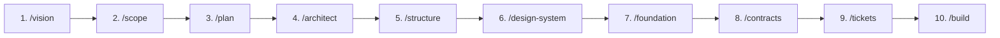

# Mini Issue Tracker (Smart Cluster & Prompt Orchestrator)

> An intelligent, lightweight issue tracker for solo developers and agile teams that automatically clusters related bugs/tasks and synthesizes them into actionable, high-context AI prompts and Pull Request specifications.

---

## Features
- **Zero-Friction Issue Management:** Lightning-fast local capture of bugs, features, and tasks with keyboard shortcuts.
- **Automated Semantic Clustering:** AI engine groups issues sharing the same root cause or component.
- **1-Click AI Coding Prompts & PR Specs:** Automatically synthesizes clustered tickets into structured prompts ready for Gemini, Cursor, or Copilot.
- **Local-First & Private:** Your data stays in your browser; optional API key for live Gemini clustering.

---

## Quickstart

### 1. Install Dependencies
```bash
npm install
```

### 2. Configure Environment (Optional)
```bash
cp .env.example .env.local
```
Add your Gemini API Key in `.env.local` to enable live LLM clustering (or use the built-in mock mode without a key).

### 3. Run Dev Server
```bash
npm run dev
```

### 4. Run Tests & Verification
```bash
npm test
```

---

## Product Playbook Lifecycle

This project was engineered following the **Product Playbook** methodology:



| Phase | Skill | Deliverable / Gate |
| :--- | :--- | :--- |
| **Phase 1: Product** | `/vision`, `/scope`, `/plan` | Defined in [PRODUCT.md](file:///c:/Users/kishore/Downloads/mini-issue-tracker/PRODUCT.md) |
| **Phase 2: Architecture** | `/architect`, `/structure` | [docs/ARCHITECTURE.md](file:///c:/Users/kishore/Downloads/mini-issue-tracker/docs/ARCHITECTURE.md) & [STRUCTURE.md](file:///c:/Users/kishore/Downloads/mini-issue-tracker/STRUCTURE.md) |
| **Phase 2: Design & UI** | `/design-system` | [DESIGN.md](file:///c:/Users/kishore/Downloads/mini-issue-tracker/DESIGN.md) & [design-preview.html](file:///c:/Users/kishore/Downloads/mini-issue-tracker/design-preview.html) |
| **Phase 2: Plumbing** | `/foundation` | `.github/workflows/ci.yml`, `.gitleaks.toml`, tests |
| **Phase 2: Data Models** | `/contracts` | `src/domain/contracts.ts` |
| **Phase 2: Work Breakdown** | **`/tickets`** | `.github/ISSUE_TEMPLATE/` & live [GitHub Issues](https://github.com/kish21/mini-issue-tracker/issues) |
| **Phase 2: Implementation** | `/build` | Milestone-by-milestone feature development |

---

## Live GitHub Feature Tickets

- 🎫 **[Issue #1: [FEAT-01] Issue CRUD, Local Storage & Manual Prompt Synthesis (M1)](https://github.com/kish21/mini-issue-tracker/issues/1)**
- 🎫 **[Issue #2: [FEAT-02] Automated Semantic Clustering Engine with Gemini & Mock Fallback (M2)](https://github.com/kish21/mini-issue-tracker/issues/2)**
- 🎫 **[Issue #3: [FEAT-03] Status Lifecycle Transitions & Multi-Format Export Profiles (M3)](https://github.com/kish21/mini-issue-tracker/issues/3)**

---

## Documentation Links
- [PRODUCT.md](file:///c:/Users/kishore/Downloads/mini-issue-tracker/PRODUCT.md) — Product Spine (Vision, Scope, Plan, Architecture, Contracts)
- [STRUCTURE.md](file:///c:/Users/kishore/Downloads/mini-issue-tracker/STRUCTURE.md) — Codebase Architecture & Folder Map
- [DESIGN.md](file:///c:/Users/kishore/Downloads/mini-issue-tracker/DESIGN.md) — Design System Specification & Token Harness
- [design-preview.html](file:///c:/Users/kishore/Downloads/mini-issue-tracker/design-preview.html) — Interactive Theme Studio & Preview
